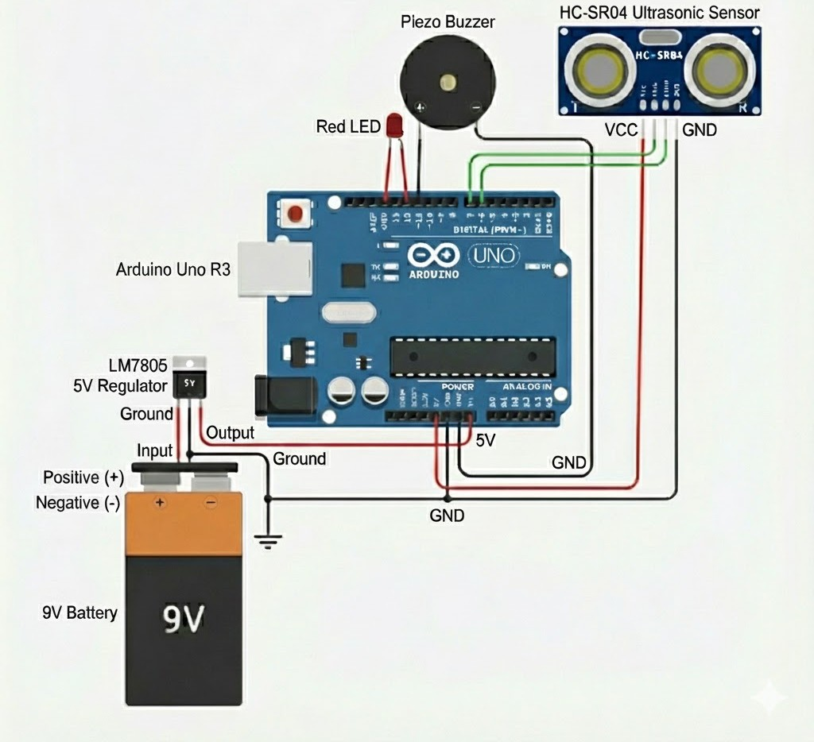
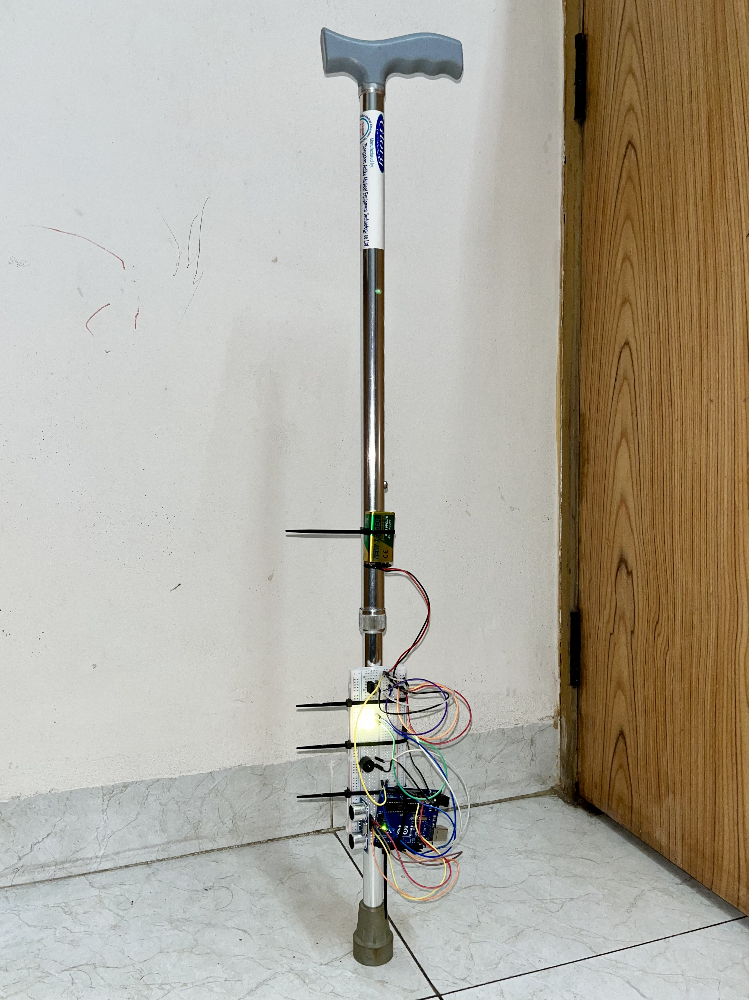

# SafeStep: Smart Blind Stick Using Ultrasonic Sensor and Arduino Uno

## Abstract
Independent mobility remains a significant challenge for visually impaired individuals, who traditionally rely on tactile feedback-based navigation aids such as the white cane. While effective, such tools often fail to detect obstacles beyond ground level or provide early warnings. This paper presents
SafeStep, a low-cost smart walking stick designed to enhance situational awareness through non-contact obstacle detection. The system integrates an Arduino Uno microcontroller with an ultrasonic
sensor to continuously monitor the environment. A distance-based control algorithm generates graded audio-visual feedback, where alert frequency increases as the user approaches an obstruction. Experimental evaluation of the prototype demonstrates reliable real-time performance with an average error margin below 2%. Owing to its affordability, simplicity, and responsiveness, SafeStep represents an accessible assistive technology solution suitable for deployment in resource-constrained environments.

## System Block Diagram

## Circuit Diagram

## Hardware Prototype
